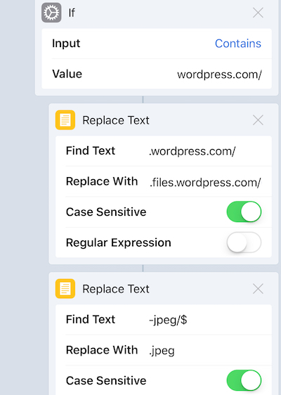
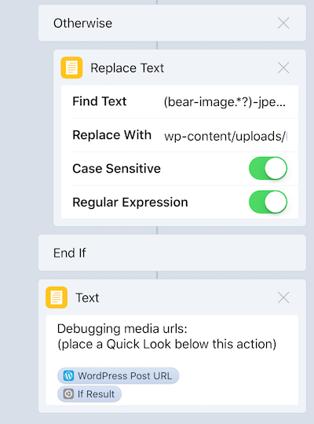

# Publish from Bear to WordPress on iOS
*Version 1.7 - 2018-01-23*

This workflow 	publishes notes from Bear to WordPress with images, tags, and feature image.

It works well with both WordPress.com and WordPress.org (self hosted WordPress) sites.

**Install Workflow:  [Bear note to WordPress](https://workflow.is/workflows/c9ece7c8e2e64d4599c74ed6824f54b4)** – iOS

*Part of: [Bear Power Pack](https://github.com/rovest/Bear-Power-Pack/blob/master/README.md)*

<!--TOC-->
<a id="toc-top"></a>
## Table of Contents
> *made with:* [Bear TOC](https://github.com/rovest/Bear-Power-Pack/blob/master/Bear%20TOC.md)  

1. [Features ](#toc-1)
2. [How to publish to WP with this workflow](#toc-2)
3. [Geeky Workarounds](#toc-3)
4. [Issues with media upload url returned from WP](#toc-4)
	1. [WordPress.com replacement strings](#toc-5)
	2. [WordPress.org replacement strings](#toc-6)
	3. [Extra `<br />` in quotes](#toc-7)
5. [Debuging](#toc-8)
6. [Regular Expressions in workflow](#toc-9)
	1. [Extracting WP tags](#toc-10)
	2. [Cleaning up](#toc-11)
<!--/TOC-->

<a id="toc-1"></a>
## [Features ](#toc-top)
- For both WP.com and WP.org sites
- Write in Bear on Mac, iPone or iPad, publish from iOS only.
- Uploads all inline photos to WP as media and updates image links accordingly.
- An image on very first line below title, will be used as feature image.  
(To make photo a regular top image, just insert a blank line above it.)
- Prompts for excerpt to be typed, pasted or skipped. 
- Text in Bear notes enclosed in double curly brackets, like this: `{{my text as excerpt}}`, will appear as default in excerpt text input (brackets are then removed from post by workflow)
- Tags are now posted: Use tags in Bear preceded with `#wp/` like this: `#wp/Dogs` or `#wp/Goats and Horses#`.  
`#wp/` has to be in lower case!  
(`#wp/` and all other tags from bear are stripped off published text).  
Settings in Bear: `Keep tags during export` must be on for this feature to work.
- NOTE! When tags are stripped off, it could also mess up code with `#` inside code blocks! So if you are publishing code, you may need to change or remove the "cleanup" RegEx action from workflow!
- WordPress `<!--more-->` tag works even if typed wrongly as `<!—more—>` due to autocorrect (mdash — instead of --).

<a id="toc-2"></a>
## [How to publish to WP with this workflow](#toc-top)
1. Select and copy a paragraph you want as excerpt.
2. Slide left on Note in note list and tap `More …` button
3. Chose `Export note …`  
4. Chose `Text Bundle`
5. Tap `Run Workflow`  
6. Tap `Bear note to WordPress` 
7. Confirm or change excerpt (from point 1.)
8. Chose `Published` or `Draft` 
9. Chose to open the published post in browser or open WP app.

<a id="toc-3"></a>
## [Geeky Workarounds](#toc-top)
*Note! If you are not a geek, you may stop reading now, unless you want to get a headache;)  
Everything you need to know is written above* 🤓

Had to make a few workarounds to get this to work properly:

1. Stripped textbundle extension & save to iCloud drive to “extract” package as folder.
2. Replace `%20` with `space` in image names from camera.
3. Image files are renamed with unique timestamp (to avoid name conflict and strange/buggy version numbered url returns from WP)
4. Used `Replace Text` to fix buggy media urls returned from WP (see below).

<a id="toc-4"></a>
## [Issues with media upload url returned from WP](#toc-top)
There is a bug in returning urls from WorkFlow’s WP action when uploading Media, so `Replace Text` actions has to be used to fix it.   
(V. 1.3 of this workflow now also works with WordPress.org (self hosted WordPress) site.)

<a id="toc-5"></a>
### [WordPress.com replacement strings](#toc-top)
Find Text: `.wordpress.com/`   
Replace with: `.files.wordpress.com/{MediaDatePath}`  

> `{MediaDatePath}` is in the format `yyyy/MM/`      
Example of replace string: `.files.wordpress.com/2018/01/`  
(`year/month/` path to media file uploads)

Find Text: `-jpeg/$`   
Replace with: `.jpeg`  
RegEx switch to `ON`



<a id="toc-6"></a>
### [WordPress.org replacement strings](#toc-top)
Find Text: `(bear-image.*?)-jpeg/$`   
Replace with: `wp-content/uploads/{MediaDatePath}$1.jpeg`  
RegEx switch to `ON`



<a id="toc-7"></a>
### [Extra `<br />` in quotes](#toc-top)
The `Make HTML from Rich Text` action inserts two  `<br />`  if linebreakrs are there in a quote. Replaced these to single  `<br />` , but this may have side effects for other users, so remove or change this as needed:

<a id="toc-8"></a>
## [Debuging](#toc-top)
For debugging, place a `Quick Look` action after the Text action to see what’s needs to be change. And check against result in html edit mode on blog site. Tip: insert a photo in WP editor and see how the image url is supposed to be.


<a id="toc-9"></a>
## [Regular Expressions in workflow](#toc-top)
Used to extract tags to WordPress and to strip off all tags from text before publish.

<a id="toc-10"></a>
### [Extracting WP tags](#toc-top)
Matching `#wp/tags` while avoiding `#spaced tags#`  
```
\#wp\/([\w/-]+)[ \n]?(?!([/ \w]+\w[#]))
```

Add matches of `#wp/spaced tags#`  
```
\#wp\/([\w/ ]+?)\#[ \n]
```

<a id="toc-11"></a>
### [Cleaning up](#toc-top)
Stripping all tags, including `#pesky space tags#` making sure no heading tags are stripped. If **#** is used in code blocks, it may be messed up by this.  

```
(?<![\S])\#[^#/\d \n][\S]*[ \n]?(?!([/ \w]+\w[#]))|(?<![\S])\#[^#/\d \n][\S ]*?\#[ \n]?
```

Big thanks to [Regex101](https://regex101.com/), without this tool, my head would have exploded.

#wp/bears #wp# #wp/dogs #wp/horses and cows# #wp/horses and goats# #Bear  
Oops! Not published with this workflow ;)

*Written with* 🐻 *on iOS and Mac*

#bear/github

